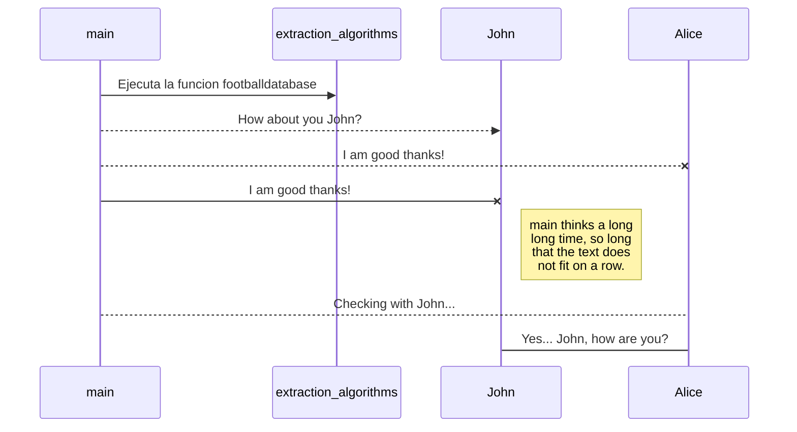
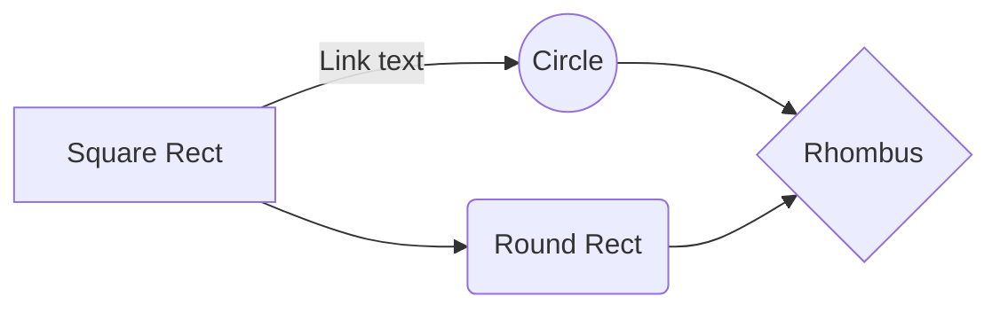

Proyecto Extracción de data sobre fútbol
======================

### Tema: Generar _Dataset_.

Versión `1.1.10`

**Contenido**

Aplicativo para brindar otro medio para la capacitación de estudiantes. Preguntas y respuestas empleando el consumo de datos via REST y JSON.

  - [Aspecto Generales](#Aspecto-Generales)
  - [Puesta en marcha](#Puesta-en-marcha)

## Aspecto Generales ##
- Ambiente de desarrollo
   información que se debe tener presente en caso de seguir trabajando sobre el aplicativo.

# Liga Ecuador DataSet
Extracción de data sobre la Liga Serie A de Ecuador

## Beautifulsoup4
Usando BS4 para extraer la metada del sitio  [footballdatabase](https://footballdatabase.com)
> Fuente

## 
https://footballdatabase.com/league-scores-tables/ecuador-serie-a-2021

- Markdown: publish the Markdown text on a website that can interpret it (**GitHub** for instance),
- HTML: publish the file converted to HTML via a Handlebars template (on a blog for example).

## Datos

Los datos que se van analizar son: las estadisticas y partidos por año.

### Estadisticas

| idP | fkEq | year | Pts | PJ | PG | PE | PP | GF | GC |
|-----|------|------|-----|----|----|----|----|----|----|
| 1   | 1    | 2021 | 20  | 8  | 7  | 1  | 0  | 17 | 3  |
| 2   | 2    | 2021 | 13  | 7  | 5  | 1  | 1  | 4  | 3  |
| 3   | 3    | 2021 | 11  | 7  | 3  | 2  | 2  | 5  | 2  |

En dicha tabla la columna fkEq es la llave foranea hacia la tabla **Equipos**, year es el año. Para obtener el orden de **posicion** se debe realizar una **consulta en base a los puntos**. **Las estadisticas se ha dividido en tres tabla** con las misma cantidad de columnas y nombres esto con el fin de obtner los puntos: **acumulados**, **local** y **visitante**.

### Partidos

| idP | Team_A | Team_B | Goal_A | Goal_B | Date       |
|-----|--------|--------|--------|--------|------------|
| 1   | 1      | 3      | 2      | 0      | 11/10/2021 |
| 2   | 2      | 1      | 3      | 1      | 12/10/2021 |
| 3   | 3      | 2      | 1      | 2      | 13/10/2021 |

En dicha tabla la columna Team_A y Team_B representa el ID del equipo, estos son un ejemplo de como se almacenan los registros de los partidos.

## Diagrama UML

And this will produce a flow chart:

## KaTeX --- Explicacion futura de las formulas para la predicción

You can render LaTeX mathematical expressions using [KaTeX](https://khan.github.io/KaTeX/):

The *Gamma function* satisfying $\Gamma(n) = (n-1)!\quad\forall n\in\mathbb N$ is via the Euler integral

$$
\Gamma(z) = \int_0^\infty t^{z-1}e^{-t}dt\,.
$$